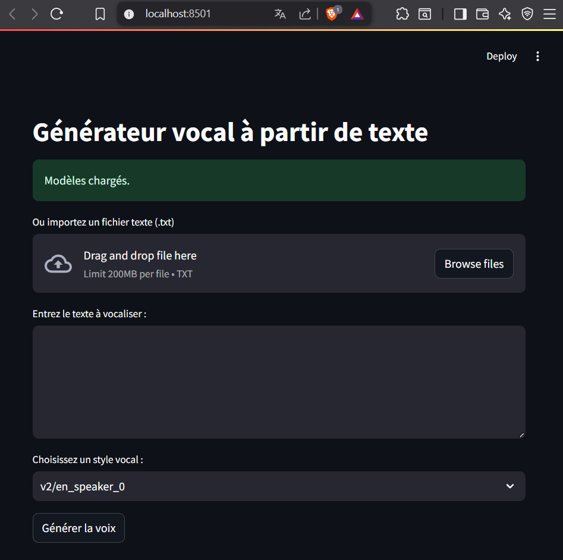
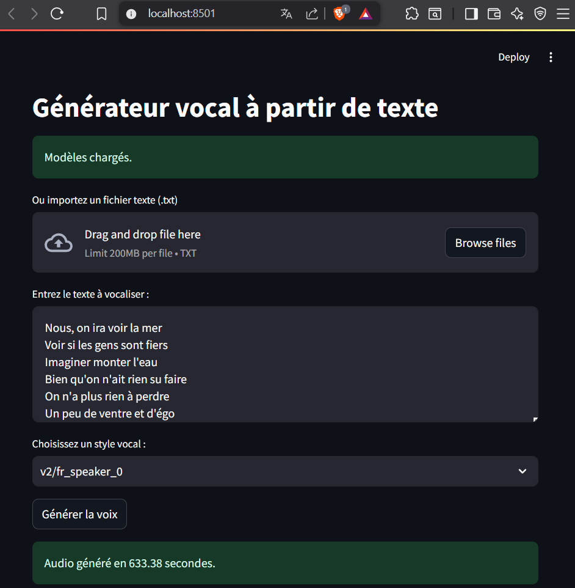
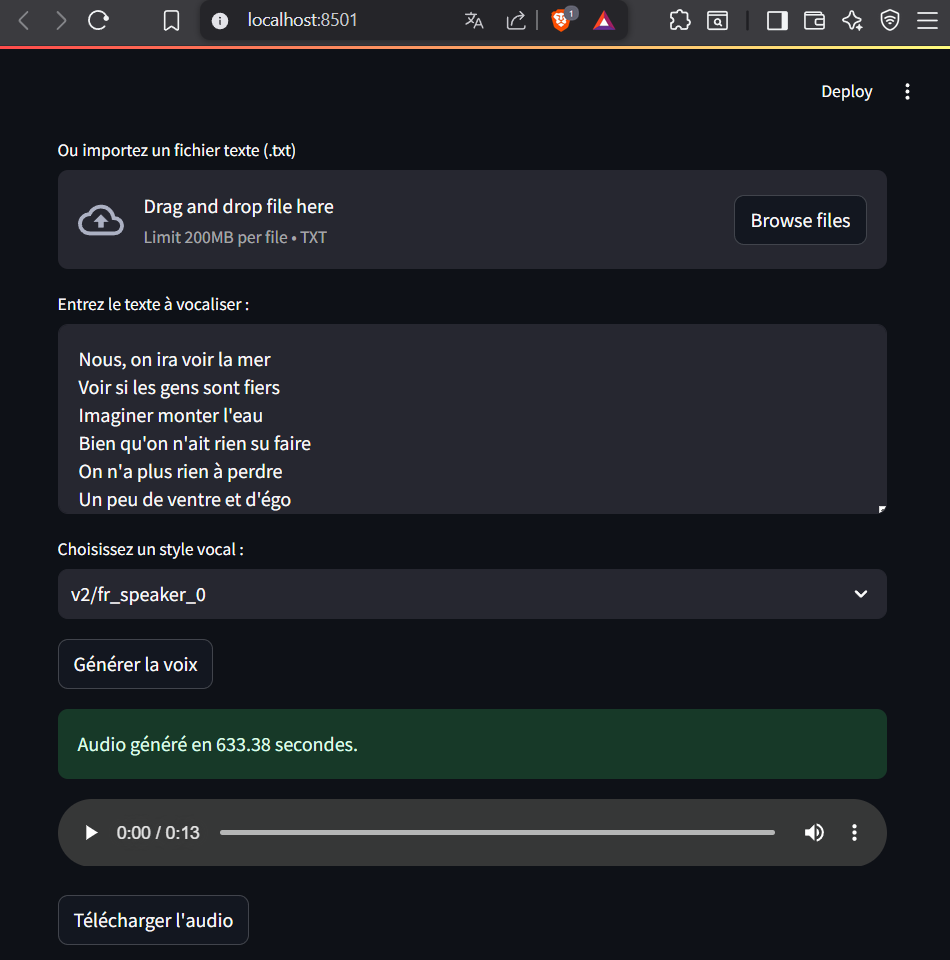

# Text-to-Music

Une application qui convertit automatiquement du texte en audio, avec une touche originale : la possibilité de générer de la musique à partir de texte grâce à l’intelligence artificielle.




## 📌 Contexte

En tant qu’étudiant en Master passionné par les applications concrètes de l’intelligence artificielle, je me suis souvent retrouvé submergé par la quantité de lectures académiques à effectuer. Après avoir développé une première application de question-réponse sur des fichiers PDF, une idée simple m’est venue :
"Et si je pouvais écouter mes PDF au lieu de les lire ?"

C’est ainsi qu’est née cette application : une solution intuitive et accessible pour transformer n’importe quel document texte en audio. Mais en y réfléchissant encore, je me suis dit :
"Pourquoi ne pas aller plus loin ? Pourquoi ne pas transformer ces textes en musique générée par l’IA ? Ce serait bien plus fun."

J’ai donc décidé de créer cet outil, à la croisée entre utilité et créativité, pour rendre mes lectures non seulement plus accessibles, mais aussi plus ludiques. C’est une application faite pour moi, pensée par nécessité, développée par passion — et que je partage aujourd’hui pour tous ceux qui, comme moi, veulent apprendre autrement.

---

## 🧠 Fonctionnalités

- 🔊 **Lecture vocale** automatique de texte
- 🎵 **Génération musicale** à partir de texte (avec IA)
- 🧰 Interface simple, pensée pour une application intuitive et rapide
- 🪄 Personnalisation du style vocal ou musical (modèles IA)



---

## ⚙️ Technologies utilisées

| Composant             | Rôle                                 |
|-----------------------|--------------------------------------|
| Python                | Langage principal                    |
| [Bark (Suno)](https://github.com/suno-ai/bark) | Génération audio à partir de texte |
| [PyPDF2 / pdfplumber] | Extraction du contenu textuel des PDF |
| Torchaudio / NumPy    | Manipulation des données audio       |
| Streamlit | Interface utilisateur  |

---

## 🚀 Lancer l'application

1. **Clonez le dépôt :**

```bash
git clone https://github.com/DavidLUTALA/Text-to-Music.git
cd Text-To-Music

```

2. **Créez un environnement virtuel (recommandé) :**

```bash
python -m venv venv
source venv/bin/activate  # sous Linux/macOS
venv\Scripts\activate     # sous Windows

```

3. **Installez les dépendances :**

```bash
pip install -r requirements.txt

```

4. Lance le script principal :

```bash
python Text-to-Music.py

```

---

## 🎯 Cas d’usage

- Étudiants souhaitant écouter leurs cours en déplacement

- Lecteurs malvoyants ou personnes avec des troubles de la lecture

- Créateurs curieux de transformer du texte en musique algorithmique

- Utilisateurs souhaitant une nouvelle façon d’interagir avec leurs documents



---

## ✨ Avenir du projet

🎚️ Personnalisation de la voix (genre, émotion)

🎼 Génération musicale multi-instruments

📖 Interface de lecture visuelle + audio combinée

---

## 📬 Contact

**David Lutala**

🎓 Étudiant en Master – Passionné d’IA créative

📧 davidlutala0@gmail.com

🌍 [LinkedIn : David LUTALA](https://www.linkedin.com/in/david-lutala-719952164/)


> *"L’IA n’est pas seulement un outil d’automatisation. C’est aussi un moyen de rendre la connaissance plus vivante."*

